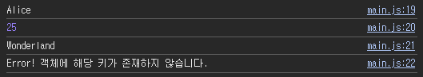
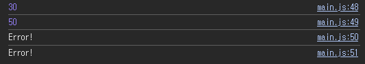

# 2024.06.07 과제
- 총 2문제 → 객체, 배열

## #1 문제
- 객체에서 특정 키의 값을 안전하게 가져오는 함수를 작성하세요.
- 객체와 키를 인수로 받아, 객체에 해당 키가 존재하면 그 키에 해당하는 값을 반환하고, 존재하지 않으면 에러를 발생시키는 함수를 작성하세요.

## #1 결과


## #1 함수 설명
```
function getValueAtObject(obj, key) {
  if (Object.prototype.hasOwnProperty.call(obj, key)) return obj[key];
  else return 'Error! 객체에 해당 키가 존재하지 않습니다.';
}
```

- `Object.prototype.hasOwnProperty.call(obj, key)`
  - 주어진 객체가 특정 속성을 소유하고 있는지 안전하게 확인하기 위함
  - 객체가 상속받은 속성을 배제하고, 오직 자기 자신만의 속성을 확인함
  - obj(객체)에 key가 존재한다면 true → if문 실행
  - 대괄호 표기법을 사용하여 key의 값을 반환
  - 만약 해당 key가 존재하지 않는다면 Error 반환

<br />
<br />

## #2 문제
- 배열에서 특정 인덱스의 값을 안전하게 가져오는 함수를 작성하세요.
- 배열과 인덱스를 인수로 받아, 인덱스가 배열의 유효한 범위 내에 있으면 그 인덱스에 해당하는 값을 반환하고, 유효하지 않은 인덱스일 경우 에러 메시지를 반환하는 함수를 작성하세요.

## #2 결과


## #2 함수 설명
```
function getNumberAtArray(arr, index) {
  if (Array.isArray(arr) && index >= 0 && index < arr.length) return arr[index];
  else return 'Error!';
}
```
- `Array.isArray(arr)`
  - arr이 배열인지 아닌지 판별
- `index >= 0 && index < arr.length`
  - index가 배열의 유효한 범위 내에 있는지 확인
  - 유효 범위: 0 이상 arr.length 미만인 경우
- 배열이고, index가 유효한 범위 내에 있다면 그 index에 해당하는 값을 반환
- 유효하지 않은 index일 경우 Error 반환

<br />
<br />

# 느낀 점

JavaScript를 공부하다 보면 응?? 하게 되는 부분이 있는데

그걸 처음 느낀 게 객체 파트이다.

공부하면 할수록 신기하다. JavaScript가 더더욱 궁금해진다.