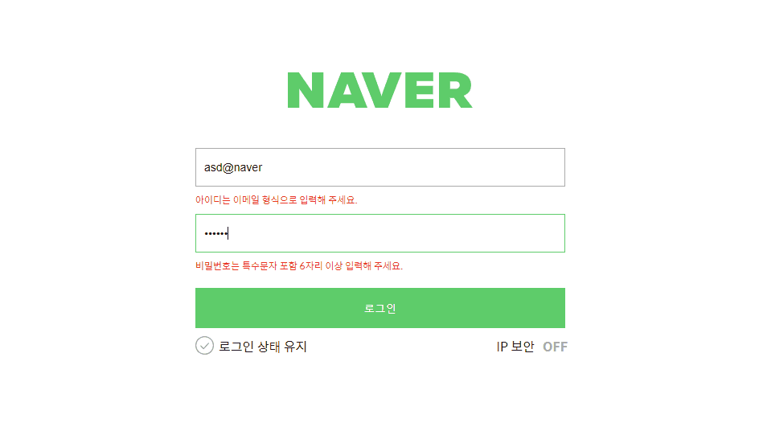
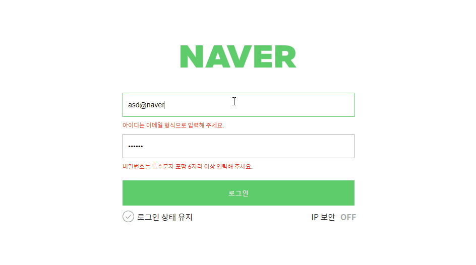

# 네이버 로그인 페이지 구현
- [네이버 로그인 과제 자바스크립트 코드 페이지](https://github.com/happyhye/js-homework/blob/main/mission01/naver_login/js/main.js)

## 문제
- 로그인과 비밀번호를 정확히 입력했을 때 welcome 페이지로 넘어갈 수 있도록 코드 로직을 작성합니다.

- 재사용 가능한 함수를 분리하고 함수를 중심으로 설계하는 방법에 대해 학습합니다.

1. email 정규표현식을 사용한 validation
2. pw 정규표현식을 사용한 validation
3. 로그인 버튼 클릭 시 user.id의 값과 input의 값을 비교
4. 로그인 버튼 클릭 시 user.pw의 값과 input의 값을 비교
5. 두 값이 일치 한다면 다음 페이지(welcome.html)로 이동

## 결과
### 아이디 또는 비밀번호를 잘못 입력했을 때


### 아이디와 비밀번호를 올바르게 입력했을 때

- welcome 페이지로 이동한다.

## 함수 설명
```
function validationHandler() {
  // 아이디(이메일) 정규식 확인
  if(emailReg(id.value)) id.classList.remove('is--invalid');
  else id.classList.add('is--invalid');

  // 비밀번호 정규식 확인
  if(pwReg(pw.value)) pw.classList.remove('is--invalid');
  else pw.classList.add('is--invalid');
}
```
- input에 입력한 값이 정규표현식과 일치하는지 확인한다.
- 만약 일치하지 않다면 `is--invalid` 클래스를 추가하고, 일치한다면 `is--invalid` 클래스를 제거한다.

** `is--invalid` 클래스를 추가하면 '아이디는 이메일 형식으로 입력해주세요.'와 같은 메시지가 나타난다.

<br />

```
function buttonHandler(e) {
  e.preventDefault();
  if(id.value === user.id && pw.value === user.pw) {
    window.location.href = 'welcome.html';
    id.value = '';
    pw.value = '';
  }
  else alert('아이디 또는 비밀번호를 잘못 입력하셨습니다.');
}
```
- 버튼 클릭 시 기본 동작(폼 제출 등)을 막아주는 `e.preventDefault()`
- input에 입력한 값과 등록한 사용자 아이디 & 비밀번호 값이 일치한다면 `welcome.html` 페이지로 이동한다.
- 그리고 input에 입력한 값을 초기화한다.
- 만약 input에 입력한 값과 사용자 아이디 & 비밀번호 값이 일치하지 않다면 alert 창을 띄운다.

<br />

# 느낀 점
처음에 페이지 이동이 안 돼서 한참을 씨름했는데

알고 보니 `e.preventDefault()`를 작성하지 않아 발생한 문제였다.

수업 시간에 아~ 하고 넘긴 부분이었는데 역시 사람은 직접 겪어봐야 안다고... 이번 과제를 통해 `e.preventDefault()`가 왜 필요한지 확실히 알게 되었다.

아쉬운 점은 input의 0번째가 id가 아닌 경우도 있으니, 이 부분은 생각해봐야겠다.
```
const input = document.querySelectorAll('input[class^="user-"]');

const id = input[0];
const pw = input[1];
```